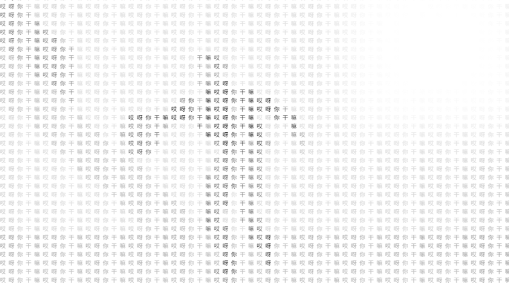

# text2image

将文字、图片、视频进行「文本化」渲染，基于 Canvas 实现。

[](https://github.com/firework-a/text2image)
[](https://github.com/firework-a/text2image)
[](https://github.com/firework-a/text2image/releases)
[](https://www.npmjs.com/package/@firework-a/text2image)
[](https://www.npmjs.com/package/@firework-a/text2image)

## 安装

```bash
npm install @firework-a/text2image
# 或
pnpm add @firework-a/text2image
```

## 快速开始

### ES 模块（Vite / Rollup / Webpack）

```js
import { createTextImage } from '@firework-a/text2image';

createTextImage({
  canvas: document.getElementById('demo'),
  source: {
    text: 'Text Image',
    fontFamily: 'Roboto Mono',
  },
});
```

### 传统脚本引入

```html
<canvas id="demo"></canvas>
<script src="./dist/text2image.iife.js"></script>
<script>
  text2image.createTextImage({
    canvas: document.getElementById('demo'),
    source: {
      text: 'Text Image',
    },
  });
</script>
```

### UMD

```js
const { createTextImage } = require('@firework-a/text2image');
```

## 返回接口

`createTextImage` 返回一个对象，包含以下方法（主要用于视频场景）：

| 方法 | 说明 |
|------|------|
| `start()` | 启动动画帧循环 |
| `stop()` | 停止动画帧循环 |

## 参数说明

| 参数 | 类型 | 必填 | 默认值 | 说明 |
|------|------|------|--------|------|
| `canvas` | `HTMLCanvasElement` | 是 | - | 作画 canvas 元素 |
| `source` | `object` | 是 | - | 作画内容，见下方各章节 |
| `replaceText` | `string` | 否 | `'6'` | 用作画的替换文本 |
| `radius` | `number` | 否 | `10` | 像素采样半径，越大越稀疏 |
| `isDynamic` | `boolean` | 否 | `false` | 是否开启帧循环（视频场景自动设为 `true`） |
| `isGray` | `boolean` | 否 | `false` | 是否灰度化 |

## 画文字


```js
createTextImage({
  // 必填，配置 canvas 元素，最终作画在其上完成
  canvas: document.querySelector('canvas'),
  // 可选，配置作画的文本，默认为 '6'
  replaceText: '6',
  // 可选，配置作画半径，该值越大越稀疏，默认为 10
  radius: 10,
  // 可选，配置是否灰度化，若开启则会丢失色彩，默认为 false
  isGray: false,
  // 必填，配置作画内容
  source: {
    // 必填，配置要画什么文本
    text: 'Text Image',
    // 选填，配置文本使用的字体，CSS 格式，默认为微软雅黑
    fontFamily: 'Microsoft YaHei',
    // 选填，配置文本尺寸，默认为 200
    fontSize: 200,
  },
});
```

## 画图片


```js
createTextImage({
  // 必填，配置 canvas 元素
  canvas: document.querySelector('canvas'),
  // 可选，配置作画的文本，默认为 '6'
  replaceText: '6',
  // 可选，配置作画半径，默认为 10
  radius: 10,
  // 可选，配置是否灰度化，默认为 false
  isGray: false,
  // 必填，配置作画内容
  source: {
    // 必填，配置图片路径
    img: './path/to/image.png',
    // 选填，配置图片宽度，默认为图片自身宽度
    width: 500,
    // 选填，配置图片高度，默认为图片自身高度
    height: 300,
  },
});
```

## 画视频



```js
// 视频场景 isDynamic 会自动设为 true，帧循环启动
const instance = createTextImage({
  // 必填，配置 canvas 元素
  canvas: document.querySelector('canvas'),
  // 可选，配置作画的文本，默认为 '6'
  replaceText: '6',
  // 可选，配置作画半径，默认为 10
  radius: 10,
  // 可选，配置是否灰度化，默认为 false
  isGray: false,
  // 必填，配置作画内容
  source: {
    // 必填，配置视频路径
    video: './path/to/video.mp4',
    // 选填，配置视频宽度，默认为视频自身宽度
    width: 500,
    // 选填，配置视频高度，默认为视频自身高度
    height: 300,
  },
});

// 需要时暂停 / 恢复
instance.stop();
instance.start();
```
